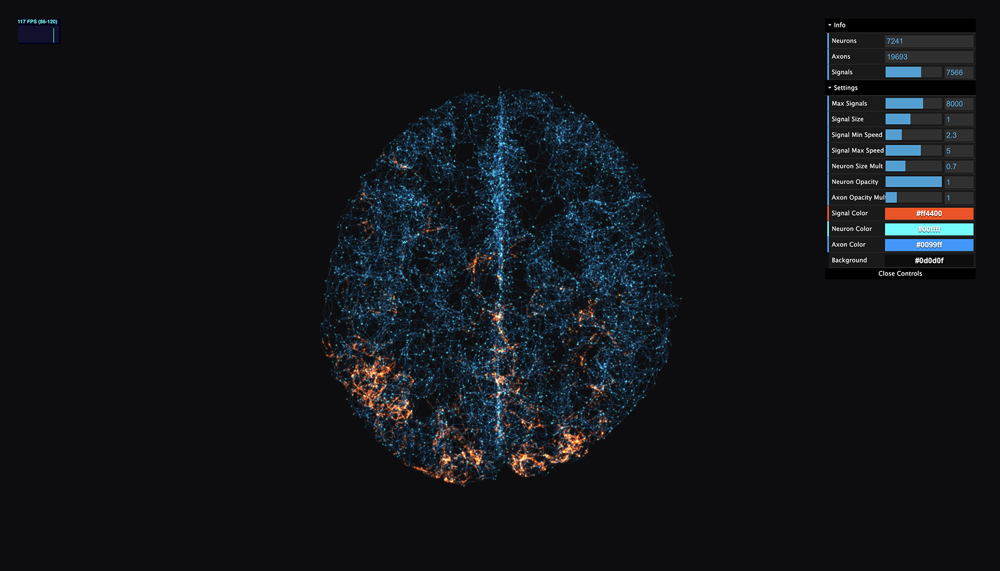

<!-- workspace-hub:cover:start -->

<!-- workspace-hub:cover:end -->

# Neural Network Prototype

Abstract visualization of a biological neural network: a 3D neural network brain built with `three.js`, shader-based rendering, and a lightweight Grunt workflow.

## Live Demo

[View the demo](https://proto.lucidity.design/sites/Neural-Network-Prototype/)

## Source

This project is a forked and modified version of the original [nxxcxx/Neural-Network](https://github.com/nxxcxx/Neural-Network) repository.

## Overview

This project renders a 3D neural-network-inspired structure made up of neurons, axons, and moving signal particles. It includes a `dat.GUI` control panel for tuning visual and motion parameters in real time, including:

- signal count and size
- signal speed range
- neuron and axon opacity
- neuron, axon, signal, and background colors

## Stack

- `three.js`
- custom vertex and fragment shaders
- `dat.GUI`
- Grunt for concatenation, minification, and local development

## Local Development

Install dependencies:

```bash
npm install
```

Start the local server with file watching:

```bash
grunt serve
```

The Grunt config serves the project from the repository root on `http://localhost:9001`.

To rebuild the bundled app script:

```bash
grunt build
```

## Project Structure

- `index.html` bootstraps the experience
- `js/` contains the neural network logic, rendering flow, and GUI setup
- `shaders/` contains the GLSL shader programs
- `models/` stores the source neural-network mesh data
- `css/` contains the app styling
